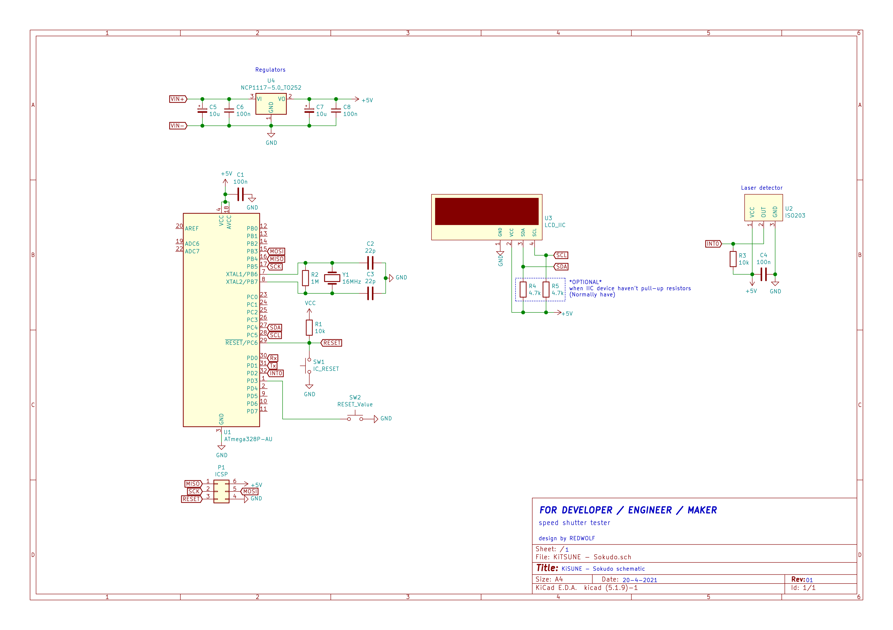

# KiTSUNE SOKUDO 🦊  
Speed shutter tester for vintage camera  
  
for beginner 👉 [WiKi](https://github.com/Wolfnest-Studio/KiTSUNE-SOKUDO/wiki)
  
## Microcontroller support
Atmega328p whit Arduino bootloader **ONLY!**  
- Arduino uno R3
- Arduino nano
- Arduino Pro mini  

## Requirement  
### Hardware  
- Laser detector module
- Laser diode
- LCD Display 2004 with LCD to IIC module
- Microcontroller
### Software
- Arduino IDE
- PlatformIO *(Recommend)*
### Library
- LiquidCrystal_I2C by [Frank de Brabander](https://github.com/fdebrabander/Arduino-LiquidCrystal-I2C-library)  

## Schematic

